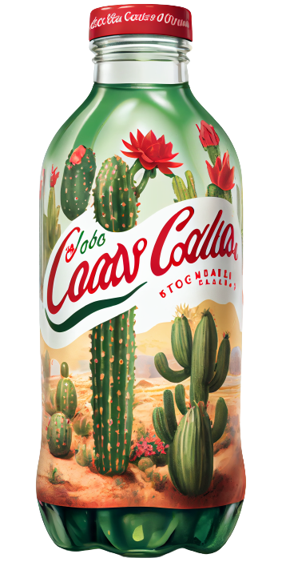

# Card 卡片

<div style="display: flex; justify-content: space-around; margin: 40px;">
        <MCard
			:width="300"
			:height="175"
			@more="moreMethod"
			color="#f40103"
			description="Coca-Cola is a globally recognized beverage brand, famous for
                its classic carbonated soft drink and a variety of flavors.
                Established in 1886, it has become an iconic name in the
                industry."
			title="Cocacola"
		>
			<template v-slot:logo>
				
			</template>
			<template v-slot:good>
				
			</template>
		</MCard>
</div>

```vue
<MCard
	:width="300"
	:height="175"
	@more="moreMethod"
	color="#f40103"
	description="Coca-Cola is a globally recognized beverage brand, famous for
					its classic carbonated soft drink and a variety of flavors.
					Established in 1886, it has become an iconic name in the
					industry."
	title="Cocacola"
>
	<template v-slot:logo>
		
	</template>
	<template v-slot:good>
		
	</template>		
</MCard>
```

<script setup>
function moreMethod() {
	console.log(123);
}
</script>

# API

## Props

| 参数        | 说明     | 类型   | 可选值 | 默认值 |
| ----------- | -------- | ------ | ------ | ------ |
| color       | 主题颜色 | string | ——     | ——     |
| title       | 文案标题 | string | ——     | ——     |
| description | 文案描述 | string | ——     | ——     |

## Slots

| 名称 | 说明      |
| ---- | --------- |
| logo | 品牌 logo |
| good | 货品图标  |

## Events

| 事件名称 | 说明           | 回调参数 |
| -------- | -------------- | -------- |
| more     | 点击按钮时触发 | -        |
